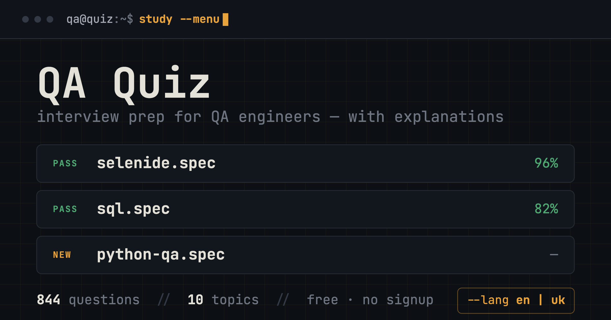

# QA Quiz

**English | [Українська](README.uk.md)**

Interactive quiz for QA engineer interview preparation. 10 topics, 844 questions, progress tracking. Fully bilingual — English and Ukrainian, switchable with the `--lang` toggle in the header.

**Try it live: [yarikmuzyka.github.io/quiz](https://yarikmuzyka.github.io/quiz/)** — free, no signup, works offline as a PWA.



## Features

- **Bilingual (i18n)** — the entire UI and all 844 questions in both English and Ukrainian; switch anywhere, even mid-question, choice persists between sessions
- **Mock Interview Mode** — 100 random questions across all topics, simulating a real interview
- **Mistake bank (spaced repetition)** — questions you got wrong persist between sessions; a dedicated `rerun --failed` mode on the dashboard, questions drop out after 2 correct answers in a row
- **Explanations everywhere** — every question comes with a short explanation, not just the correct answer
- **Dashboard** — best score, sessions played, and per-topic progress rendered as a CI test-runner spec list with PASS/FAIL statuses
- **Build badge on results** — a shields.io-style `PASSED · A` / `FAILED · F` grade after every run
- **Failures log** — after finishing, review every missed question with the correct answer and explanation
- **Fisher-Yates shuffle** — questions and answer options are reshuffled on every run
- **Finish anytime** — the score is calculated against the questions you actually answered
- **Local-first** — all progress lives in `localStorage`; no accounts, no tracking of personal data
- **Responsive** — works well on mobile

## Topics

| Topic | Questions |
|-------|-----------|
| Selenide | 107 |
| QA Automation | 105 |
| Python for QA | 100 |
| REST Assured | 98 |
| Playwright + TS | 93 |
| Java Core | 92 |
| SQL & Databases | 90 |
| System Design | 59 |
| Testing Basics | 55 |
| AI in Testing | 45 |

**844 questions total**, every single one available in both languages.

## Running locally

### Option 1 — Python
```bash
python3 -m http.server 8080
```
Open http://localhost:8080

### Option 2 — Node.js
```bash
npx serve .
```
Open http://localhost:3000

### Option 3 — just open the file
Double-click `index.html` — it opens in the browser.
(Fonts load from Google Fonts, so internet is required on first load.)

## Project structure

```
├── index.html   — markup
├── style.css    — styles (CI Console theme)
├── quiz.js      — logic + question bank (en/uk)
├── sw.js        — service worker (PWA, network-first)
├── tools/
│   ├── apply-translations.mjs   — inserts translations into the bank
│   └── translations/*.json      — per-topic translation files
└── README.md
```

No frameworks, no build step — vanilla JS/HTML/CSS served as a static page.

### Adding or updating question translations

Translations live in `tools/translations/<topic>.json` (an array of `{q, o, e}` in bank order). Apply them with:

```bash
node tools/apply-translations.mjs tools/translations/selenide.json
```

The script is idempotent: already-translated entries are skipped, and a count mismatch fails loudly.
